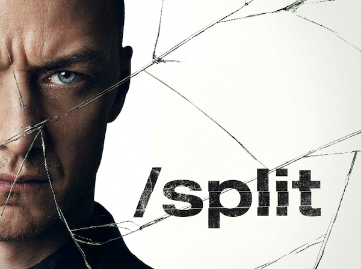

<div align="center">
  
</div>

# Split Plugin

A Claude Code plugin that splits into multiple famous, opinionated personalities to debate your work. They react independently, clash where they disagree, fight it out, and deliver a sharp synthesis. More: [kamens.com/blog/split-plugin](https://kamens.com/blog/split-plugin)

## Install

```
/plugin marketplace add https://github.com/kamens/split-plugin
/plugin install split
```

Then restart Claude Code.

## Usage

```
/split please have puzzle experts review my prompt for creating crossword clues
/split please give me blog feedback on this draft post: https://kamens.com/blog/generating-custom-mazes-with-ai
/split please review the pricing strategy doc in this repo
/split need ecommerce/marketing/conversion experts to analyze my landing page for elbobooks.com [PASTED IMAGE]
/split <paste your text directly>
```

Give it anything — a file path, a URL, pasted text, or just describe what you want reviewed and it'll search your codebase to find it.

## How it works

1. **Pick personalities** — Picks 3-5 famous, opinionated thinkers whose views are relevant to your work and who will genuinely disagree with each other. Reviewing a landing page? You might get Ogilvy, Godin, and Dunford. Pricing strategy? Thiel vs Ries. Each personality is deeply researched and built to react in character.
2. **Split personalities** — Launches all personalities in parallel. Each reacts independently with specific, artifact-grounded feedback.
3. **Debate conclusions** — Spots true clashes between personalities. Brings them back for one round to concede, push back, or evolve.
4. **Synthesize results** — Synthesizes everything into a tight summary with prioritized actions. Optionally saves the full debate to a file.

## Example personalities

**Reviewing a crossword prompt:**

```
/split please have puzzle experts review my prompt for creating crossword clues
```
```
Splitting into 4 personalities...

WILL SHORTZ — legendary NYT crossword editor. Will judge clue craft,
wordplay quality, and solver satisfaction.
MARIA MONTESSORI — child development pioneer. Will scrutinize
age-appropriateness and learning value.
SIMON SINEK — clarity-of-purpose evangelist. Will question whether the
prompt communicates intent effectively to the LLM.
MERL REAGLE — beloved puzzle constructor known for fun and accessibility.
Will push for more playfulness and better clue variety.
```

**Analyzing a landing page from a screenshot:**

```
/split need ecommerce/conversion/marketing expert analysis of this landing page screenshot
```
```
Splitting into 4 personalities...

DAVID OGILVY — proof-obsessed ad man. Will demand more evidence,
testimonials, and a longer persuasion path.
SETH GODIN — tribes evangelist. Will ask who this is really for and
whether it's remarkable enough to spread.
APRIL DUNFORD — positioning nerd. Will scrutinize competitive context
and whether the value prop is clear.
JOANNA WIEBE — conversion copywriter (Copyhackers). Will tear apart
the CTA hierarchy, microcopy, and friction points.

Fault lines: proof density vs. clean design | broad vs. niche audience |
copy length vs. scannability | two CTAs
```

You approve the lineup (or swap personalities), then the split runs and delivers a synthesis.

## Design

The personalities aren't generic archetypes. They're real, well-known thinkers selected for the specific tensions in your artifact. The skill picks minds in pairs that predictably disagree, so the debate produces genuine insight rather than a list of suggestions.

Round 2 only happens when there are true clashes — mutually exclusive recommendations. If the personalities agree, that's a valid outcome.

[kamens.com/blog/split-plugin](https://kamens.com/blog/split-plugin)
