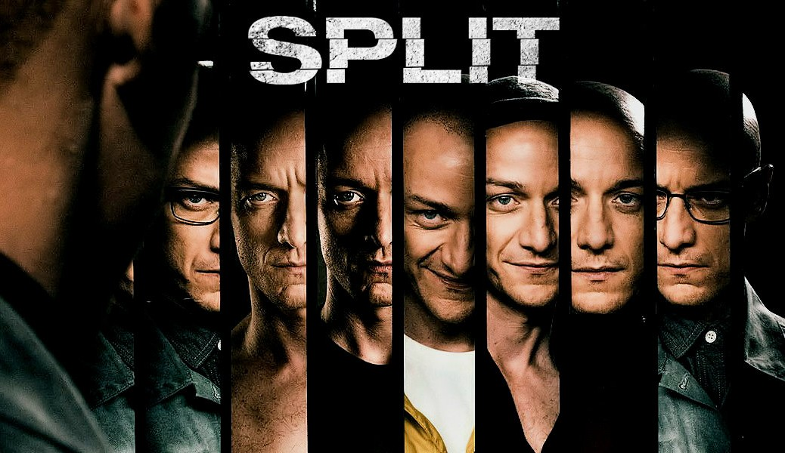

# Split Plugin



A Claude Code plugin that splits into multiple famous, opinionated personalities to debate your work. They react independently, clash where they disagree, fight it out, and deliver a sharp synthesis.

## Install

```
/plugin marketplace add https://github.com/kamens/split-plugin
/plugin install split
```

Then restart Claude Code.

## Usage

```
/split:split path/to/draft.md
/split:split https://example.com/landing-page
/split:split please review the pricing strategy doc in this repo
/split:split <paste your text directly>
```

Give it anything — a file path, a URL, pasted text, or just describe what you want reviewed and it'll search your codebase to find it.

## How it works

1. **Assembly** — Analyzes your artifact, identifies tension axes, picks 3-5 real thinkers who will productively clash (Ogilvy vs Godin, Thiel vs Ries, etc.)
2. **The Split** — Launches all personalities in parallel. Each reacts independently with specific, artifact-grounded feedback.
3. **The Fight** — Spots true clashes between personalities. Brings them back for one round to concede, push back, or evolve.
4. **Delivery** — Synthesizes everything into a tight summary with prioritized actions. Optionally saves the full debate to a file.

## Design

The personalities aren't generic archetypes. They're real, well-known thinkers selected for the specific tensions in your artifact. The skill picks minds in pairs that predictably disagree, so the debate produces genuine insight rather than a list of suggestions.

Round 2 only happens when there are true clashes — mutually exclusive recommendations. If the personalities agree, that's a valid outcome.
